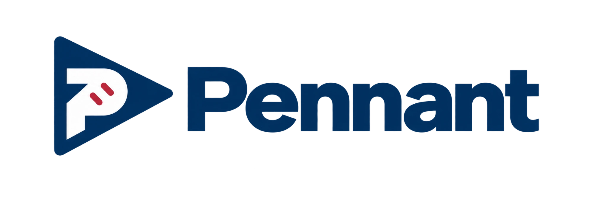

# Pennant

<p align="center">
  
</p>

**Run the organization, not the spreadsheet.**

Pennant is a local companion for an **Out of the Park Baseball 27** save. It is built around one idea: running a
baseball organization should feel like being its GM. You see the evidence, the constraints, the competing priorities
and the consequences of each option — and you make the decision yourself.

Pennant reads OOTP's CSV export into a local SQLite database and serves a React application in your browser or as a
desktop app. Your save stays on your machine, and Pennant never writes to it.

```text
OOTP CSV export  →  importer (SQLite)  →  local server  →  browser or desktop app
```

> Pennant began as a fork of [lsukev/ootp-front-office](https://github.com/lsukev/ootp-front-office) and has since
> diverged into its own project with its own architecture and version numbers. See
> [Relationship to upstream](#relationship-to-upstream).

## What Pennant is

- **A decision-support companion, not an autopilot.** It calculates, flags, compares and explains. It never makes an
  OOTP transaction and never writes to your save. A recommendation is an advisory option with its evidence and
  safeguards; the GM decides.
- **Organization-first.** The work is divided the way an organization divides it — Baseball Operations, MLB
  Operations, Minor League Operations, Player Development — and each part owns one kind of question.
- **Honest about what your organization can know.** Judgments about ability, ceiling and readiness use the ratings
  your scouts report and the history Pennant has observed, never OOTP's hidden true-talent values. Where scouting
  evidence is missing, Pennant says so instead of filling it in.

## The operating model

Two chains of evidence feed the operations modules, and they stay separate.

```text
Scouted Evidence  →  Player Development  →  Organizational Philosophy  →  Operations  →  GM

Player State  →  Player Rights  →  Operations  →  GM
```

- **Scouted Evidence** is what your organization can see: the exported scouting ratings and the observation history
  Pennant keeps across imports.
- **Player Development** decides which assignments are *defensible* for a player on that evidence. It is the same for
  every organization.
- **Organizational Philosophy** expresses how *your* organization prefers to choose among defensible options. It can
  reorder and re-word advice; it can never make an indefensible move defensible.
- **Player State** is what is true now, as exported: who is on the 40-man, option counters, waiver countdowns,
  service time, injuries. **Player Rights** turns that state, OOTP's transaction log and the league's rules into what
  each transaction is currently `eligible`, `ineligible` or `indeterminate` for — with the basis for every reason.
- **Operations** solve roster problems *inside* those boundaries. Roster pressure cannot manufacture a development
  case, and philosophy cannot override a safeguard.
- **You, the GM,** decide whether to act.

## Major capabilities

- **MLB Operations.** Roster problems derived from the current export — a role below its coverage floor, an open
  active spot, an injured player's return crunch, a "what if he is out?" — each with staged responses (an internal
  role change, a recall, an addition to the 40-man), the rights for each step, Player Development's view of the
  assignment, the roster effect and the farm's consequence. A scouting-department review flags pitchers and hitters
  worth a second look, with the working estimate always shown with its parts.
- **Minor League Operations.** Whether each assignment is defensible, who is competing for which job and what they
  are getting, how healthy each affiliate is (operationally and developmentally, never merged), where the
  organization is congested, and what a retention decision is really asking. Recent usage is counted in club games
  and a man too new to a club to be read is `unknown`, not unused.
- **Farm cascades.** When a departure opens a hole, Pennant follows the chain of independently defensible moves and
  says where it stops. An unresolved hole is information, never an illegality.
- **Player Development and Scouted Development.** Prospect readiness, destination-aware assignments, development
  protection, and a history of how your scouts' evaluations have moved.
- **Roster state and rights.** The 40-man, options, waivers, injured lists and rehab assignments read as exported and
  as logged, with a header chip showing how current each source is.
- **Organizational Philosophy.** Per-organization preference profiles and policies, applied only after development
  has ruled.
- **Structured uncertainty.** Every finding is data — its evidence, its owner, what is missing and what would resolve
  it — not prose. A path is only as certain as its least certain step.
- **The daily desk.** Dashboard, standings, schedule and probable starters, lineups, pitching availability, rosters,
  depth chart, injuries, contracts, payroll, free agents, trades, draft, franchise history, leaderboards, watchlist.
- **Optional AI staff.** GM briefings, storylines, trade discussion and staff chat, grounded in the application's own
  API. See [AI](#ai-is-optional).

## What Pennant deliberately does not do

- **No hidden true talent.** It does not read OOTP's true-talent values and does not pretend to omniscience.
- **No automatic transactions.** It never executes a move, edits a roster or touches your save.
- **No universal player score.** There is no single number that ranks everyone. Judgments are per role, per level,
  per question, and carry their standard and their sample.
- **No LLM as the decision engine.** The baseball conclusions are deterministic TypeScript and SQL over your import.
  An AI model may summarize or discuss those results; it does not produce a parallel recommendation.
- **No guessing at rules it has not seen.** A transaction rule that has not been observed or documented is
  `indeterminate`, not assumed from real-world MLB.

## Installation

### Desktop app

Pennant has not published installers yet. When it does, they will appear on the
[Releases page](https://github.com/dakota86005/ootp-front-office/releases). Until then you can build one locally:

```bash
npm install
npm run dist:mac    # or: npm run dist:win
```

Local macOS builds are unsigned, so Gatekeeper will ask you to open the app from its context menu the first time.
Windows builds are unsigned, so SmartScreen may ask you to use **More info → Run anyway**. Signed and notarized macOS
releases need repository secrets that are not configured yet; see [docs/DEVELOPMENT.md](docs/DEVELOPMENT.md#releases).

The desktop app stores imported data, settings, history and AI caches in its OS user-data folder, outside the app
bundle. Updates are consent-first: the app can check for releases, but downloading and installing need your action.

### Run from source

Requirements:

- OOTP Baseball 27 with at least one save
- Node.js 20 or newer
- macOS or Windows for the supported save auto-detection paths
- Optionally, an AI provider key, or a running local Ollama service

```bash
git clone https://github.com/dakota86005/ootp-front-office.git
cd ootp-front-office
npm install
npm run dev
```

Open <http://localhost:5173>.

`npm install` compiles the native `better-sqlite3` dependency. If that fails, install the Xcode Command Line Tools on
macOS (`xcode-select --install`) or the **Desktop development with C++** workload from
[Visual Studio Build Tools](https://visualstudio.microsoft.com/downloads/) on Windows, then retry.

### Source and desktop data

Source mode keeps its data in the repository's `data/` directory; the desktop app uses its OS user-data directory.
They are separate installs with separate settings, databases and histories. To deliberately use the desktop data from
source, set `OOTP_FO_DATA_DIR` to the desktop data folder before starting, and run only one copy against a shared data
directory at a time.

The `OOTP_FO_*` variable names and the `ootp-front-office` data-folder name are inherited from before the project was
renamed. They are kept on purpose so existing installs and shell configuration keep working (D-049).

## Development

There is one development command:

```bash
npm run dev
```

It starts the web app on port 5173 and the API on port 5178, and proxies `/api` from one to the other. Set `PORT` to
move the page and `OOTP_FO_API_PORT` to move the API; they can never collide. Everything else — tests, builds,
packaging, the production-style single-process server and releases — is in
**[docs/DEVELOPMENT.md](docs/DEVELOPMENT.md)**.

```bash
npx tsc --noEmit   # TypeScript validation
npm test           # Vitest suite over a synthetic temporary league
npm run build      # Vite production build
```

The core architecture is one domain API: React, Electron, the static export and the AI tools all use the same
Express-backed calculations. Imported `league.db` is a replaceable snapshot of the current export; `history.db`
retains scouting observations and user-owned state across imports.

```text
server/     Express API, importer, domain models, AI providers, and history store
src/        React UI, pages, shared presentation and API client
electron/   Desktop shell, preload bridge and updater
scripts/    Dev orchestration, measurement and desktop-build helpers
docs/       Architecture, decisions, roadmap, project state, subsystem design records
data/       Runtime state in source mode (gitignored)
```

Project references:

- [Documentation index](docs/README.md) — which document is current and which is a historical record
- [Architecture](docs/ARCHITECTURE.md) — runtime, boundaries, data flow and subsystem ownership
- [Decisions](docs/DECISIONS.md) — durable product and evidence decisions
- [Roadmap](docs/ROADMAP.md) — foundations and future work
- [Project state](docs/PROJECT_STATE.md) — a point-in-time implementation inventory and known gaps
- [Changelog](CHANGELOG.md) — Pennant's release history
- [AGENTS.md](AGENTS.md) — guidance for coding agents

## Normal OOTP workflow

### Export your league

Pennant never parses or modifies OOTP's binary save files. In OOTP 27:

1. Load the save.
2. Open **Database Tools**.
3. Choose **Global Actions → Export data to CSV files**.
4. Wait for the export to finish.

OOTP writes the CSVs under `<save>.lg/import_export/csv/`. Pennant accepts that CSV directory, the `.lg` save
directory, or its `saved_games` parent, and detects common delimiters and encodings.

The app scans common OOTP 27 saved-game folders on macOS and Windows, including direct and Mac App Store installs and
common OneDrive locations. If it cannot find your save, choose a folder manually in the app.

| Platform | Default location scanned |
| --- | --- |
| macOS (Mac App Store) | `~/Library/Containers/com.ootpdevelopments.ootp27macqlm/Data/Application Support/Out of the Park Developments/OOTP Baseball 27/saved_games/` |
| macOS (direct download) | `~/Library/Application Support/Out of the Park Developments/OOTP Baseball 27/saved_games/` |
| Windows | `Documents/Out of the Park Developments/OOTP Baseball 27/saved_games/` |
| OneDrive | `~/Library/CloudStorage/OneDrive-Personal/ootp/saved_games/` or `~/OneDrive/Documents/Out of the Park Developments/OOTP Baseball 27/saved_games/` |

### Transaction context (automatic)

The CSV says where each player is now; it does not say how he got there. From the export's location Pennant finds the
matching `<save>.lg` and reads a private, validated copy of the transaction log OOTP keeps in that save's `temp`
folder — no extra step, and nothing in your save is ever written to. That is how it tells an injury-rehab assignment
from an option, which look identical in the export. The **Roster data** chip in the header shows how current each
source is. If the save folder or its log cannot be found, everything keeps working from the CSV and the chip says the
transaction log is unavailable.

### Refresh and history

After simming, export the CSVs again. Pennant watches the selected export and can re-import automatically;
**Refresh** forces an import. Each import preserves a separate local scouting-history database and records observed
ratings, so repeated exports build the material for Scouted Development.

### Share a static snapshot

**Settings → Share** creates a read-only static site from your league data. It is not a live application:
server-backed and writable features such as AI, settings, chat and the operations workspaces are omitted.

### LAN access

The server binds to loopback by default. To expose it on a trusted LAN in source mode:

```bash
OOTP_FO_BIND=0.0.0.0 npm start
```

There is no authentication in LAN mode. Anyone who can reach it can read the save and change local app settings; cloud
AI use could also consume your provider credits. Do not forward the port from your router. For a custom hostname, add
it with `OOTP_FO_ALLOWED_HOSTS`.

## AI is optional

AI is supporting staff, not the decision engine. It can write GM briefings, storylines, trade discussion and staff
chat grounded in Pennant's own API. The non-AI application works without any provider credential.

Supported providers are Anthropic, OpenAI, Google Gemini, OpenCode Zen and **Ollama (local)**. Choose one in
**Settings → AI Features**; provider and model can be global or per feature. Cloud providers need their API key;
Ollama uses a local OpenAI-compatible server and needs none (default `http://127.0.0.1:11434`, or `OLLAMA_BASE_URL`).
Cloud requests contain only the game-data context assembled for the feature you invoke. Credentials are stored
locally, using OS-backed storage in packaged builds; `ANTHROPIC_API_KEY`, `OPENAI_API_KEY`, `GEMINI_API_KEY` and
`OPENCODE_API_KEY` also work.

## Statistics

The Rosters page supports configurable batting and pitching columns, including derived statistics such as OPS+,
wRC+, ERA+, FIP and wOBA. OOTP does not export all of these, so Pennant derives them from the imported league context
using league and level baselines and OOTP park ratings. `npm run check:stats` checks the aggregate centering against
an import.

Player Development and the operations modules read ability only through one evidence adapter, from the exported tool
ratings rather than OOTP's own Overall and Potential. Their current and potential figures are a Pennant summary of the
visible tools on a 20–80 scale whatever scale the save displays, so they will not always match the number on the
in-game player card. Where a grade is not exported the page says the evidence is incomplete.

## Troubleshooting

**No OOTP saves detected** — choose the save folder, its `saved_games` folder, or `<save>.lg/import_export/csv/`
manually, and confirm you have made a CSV export.

**A save has no export** — load the correct save in OOTP and repeat **Database Tools → Global Actions → Export data
to CSV files**.

**A page is empty or a statistic looks stale** — re-export from OOTP and use **Refresh**. Exports may omit optional
fields; unavailable evidence is shown as unavailable rather than inferred.

**Scouted Development has little to show** — it needs observed snapshots across exports and dates. Export again after
simming; early history is necessarily sparse.

**Ollama cannot be reached** — start Ollama locally and confirm its endpoint, or set `OLLAMA_BASE_URL`.

**A port is in use** — `npm run dev` fails rather than silently moving to another port. Stop the other process, or set
`PORT` (page) and `OOTP_FO_API_PORT` (API).

## Status and roadmap

Pennant is pre-1.0. The Baseball Operations foundation is in place — evidence, Player Development, Player State and
Rights, philosophy, MLB Operations and Minor League Operations with their integration — and several models are
explicitly *provisional* until there is enough history to calibrate them. Next planned work includes a peer-relative
player-protection tier, the remaining injured-list and Rule 5 rights, and staff-derived philosophy. Nothing on the
roadmap should be read as implemented; [docs/ROADMAP.md](docs/ROADMAP.md) separates what exists from what is planned,
and [docs/PROJECT_STATE.md](docs/PROJECT_STATE.md) records what is verified.

## Relationship to upstream

Pennant began as a fork of [lsukev/ootp-front-office](https://github.com/lsukev/ootp-front-office), created and
maintained by Kevin Ivy. It builds on that project's import pipeline, interface, statistics and roster tools,
transactions tooling, AI features and much else, and is grateful for that foundation. The fork has since diverged
substantially — a different product direction, a different architecture, and its own version numbers starting at 0.1.0
— and it follows that direction independently. The original author has not endorsed Pennant. Upstream's own release
notes are preserved in [docs/upstream/](docs/upstream/README.md).

## OOTP disclaimer

Pennant is an unofficial fan project. It is not affiliated with or endorsed by Out of the Park Developments or Out of
the Park Baseball.

## License

MIT — see [LICENSE](LICENSE). The license retains Kevin Ivy's copyright notice for the code Pennant inherited.
